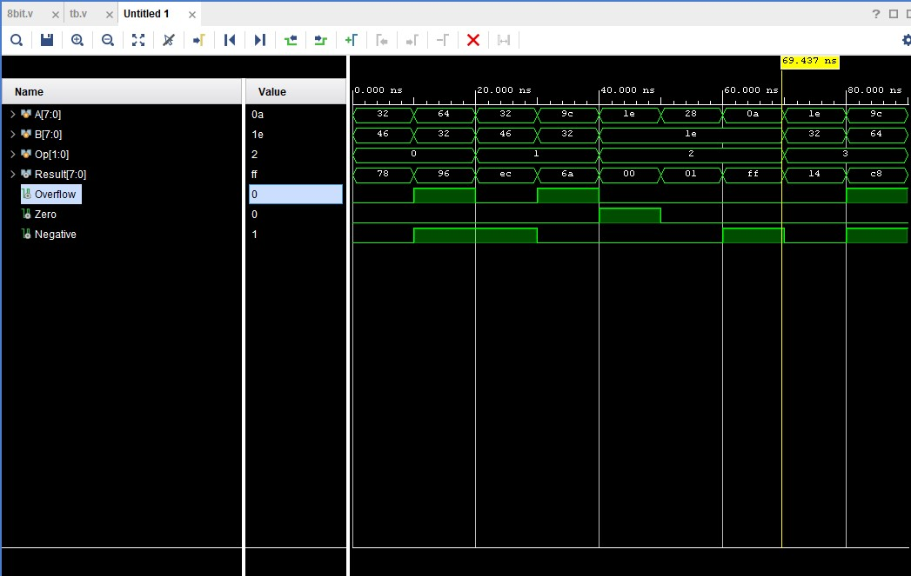
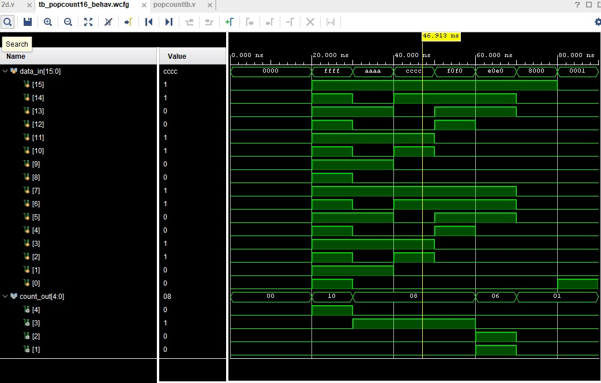
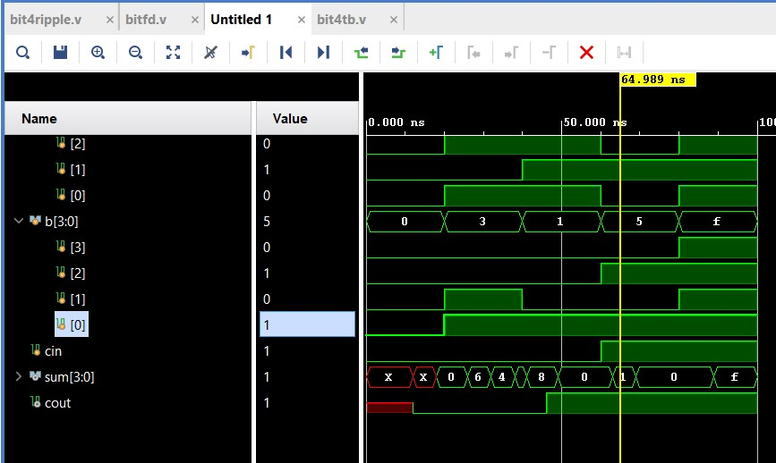
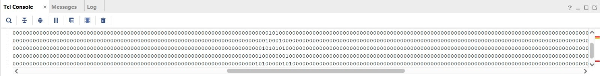

# Digital DNA
**Prerequisite:** An elementary understanding of Digital Logic
**Objective:** Mastering Verilog Through Creative Circuit Design
**Task:** Begin your journey into Verilog HDL by building meaningful projects.
## What is Verilog?
Verilog is a hardware description language (HDL) used to design and model digital electronic systems such as microprocessors, FPGAs, and ASICs..
**Purpose:** Instead of drawing circuits with gates and wires, you describe hardware behavior in code.
**Usage:** Widely used in VLSI design, FPGA programming, and ASIC development.
**Nature:** Unlike software languages (C, Python), Verilog doesn’t write instructions for a CPU—it describes actual hardware circuits.
### Types of modelling in Verilog 
1. Structural Modelling: Describe how gates/wires are connected.
2. Behavioral Modelling Describe circuit behavior using always blocks, if, case, etc.
3. Dataflow Modelling: Use Boolean expressions.

**Task 1**:Design and test an 8-bit signed arithmetic unit with operations:
Addition (00),Subtraction (01),Comparison (10) & Absolute difference (11)
Generate 3 status flags: overflow, zero, negative
**Outcomes and Process**
- Using of case statemes for each operation.
- Assigning status for each flag.
- Getting familiar with AMD Vivado .

**Task 2**:Design a 2D Population Count Circuit that analyzes a 4×4 binary matrix and provides comprehensive bit counting statistics.
A population count (often called Hamming weight, bit count, or ones count) is the process of counting the number of 1s in the binary representation of a number.
**Outcomes and Process**
  - Using of 4X4 matrix and changing its possible values.
  - Obtain the count of ones in it.
  - The population count has been done.

**Task 3**:Design and test a 4-bit Ripple Carry Adder using a Generate Block. Each gate has a Rise, Fall, and Turn-Off Delay of 3ns, 6ns, and 2ns respectively.
**Note** The version in MARVEL does not support 3 delays i.e Rise,fall and Turn off. I had to do with 2 delays.
- A Ripple Carry Adder is a type of digital circuit used to add two binary numbers. It’s built by connecting full adders in series.
- Each full adder adds 2 input bits + a carry-in.
The carry-out from one adder is given to the carry-in of the next adder.
The carry “ripples” through the chain, hence the name.
**Disadvantages**
  Slow for large numbers because the carry must ripple through all stages.
**Outcomes**
  - Module Instantiation
  - Usage of delays

**Bonus Challenge** Design and test a Cellular Automaton of your choice: Rule 90, Rule 110, or 16x16 Conway's Game of Life.
**Rule 90**
Rule 90 is a one-dimensional cellular automaton with interesting properties.
The rules are simple. There is a one-dimensional array of cells (on or off). At each time step, the next state of each cell is the XOR of the cell's two current neighbours. A more verbose way of expressing this rule is the following table, where a cell's next state is a function of itself and its two neighbours.
The name "Rule 90" comes from reading the "next state" column: 01011010 is decimal 90.

[Github Codes](https://github.com/Nash1126/digitaldna)

# Logic Lore

**Prerequisite:** Level 1 Task 10 - LUTs

**Objective:** Exploring FPGA Architecture

**Task:** Understand the following theoretically:
- Basic Xilinx Architecture
- Configurable Logic Block (CLB)
- Switch Matrix
- How they combine with memory to form a basic FPGA tile

## Basic Xilinx FPGA Architecture (Theoretical Overview)

This document explains the **theoretical structure** of a Xilinx FPGA, focusing on:
- Configurable Logic Blocks (CLBs)
- Switch Matrices
- Configuration Memory
- How these combine to form a basic FPGA tile

## 1. Basic Xilinx Architecture (Big Picture)

A Xilinx FPGA is organized as a **two-dimensional grid of programmable tiles**.

Each tile contains:
- **Configurable Logic Blocks (CLBs)** – computation
- **Switch matrices** – routing and interconnection
- **Configuration memory (SRAM)** – defines behavior

### Key Characteristics
- Logic is **distributed**
- Hardware functionality is **defined after fabrication**
- The FPGA is programmed by loading configuration bits at power-up

## 2. Configurable Logic Block (CLB)

The **CLB** is the primary logic element of the FPGA.

### Purpose
Implements **combinational and sequential digital logic**.

### Main Components
- **Look-Up Tables (LUTs)**
  - SRAM-based truth tables
  - Implement arbitrary Boolean functions
  - Example: a 6-input LUT can implement any 6-input logic function

- **Flip-Flops (Registers)**
  - Store state
  - Used in counters, FSMs, pipelines

- **Carry Logic**
  - Dedicated fast paths for arithmetic operations

- **Local Multiplexers**
  - Select between LUT outputs, registers, and carry chains

## 3. Switch Matrix (Routing Fabric)

The **switch matrix** provides programmable interconnection between logic blocks.

### Purpose
Enables **flexible routing of signals** across the FPGA.

### Components
- Horizontal and vertical routing tracks
- Programmable switches (multiplexers / pass transistors)
- Connection points to:
  - CLBs
  - Other tiles
  - I/O blocks
  - Memory and DSP blocks

## 4. Configuration Memory

Configuration memory controls both logic and routing.

### Characteristics
- Typically **SRAM-based**
- Millions of bits distributed across the FPGA
- Volatile (lost on power-down)

### Controls
Configuration bits define:
- LUT truth tables
- Flip-flop behavior (enable, reset, clocking)
- Routing switch connections
- Clock and I/O behavior

## 5. FPGA Tile Structure

An **FPGA tile** is the fundamental repeating unit of the fabric.

### Tile Contents
- One or more **CLBs**
- A surrounding **switch matrix**
- Associated **configuration memory**

### Functional Flow
1. Configuration memory programs logic and routing
2. CLBs perform computation
3. Switch matrices route signals between tiles

## 6. How Tiles Form the FPGA

- Tiles are arranged in a **2D grid**
- Specialized tiles (BRAM, DSP, I/O) are interspersed
- Global routing and clock networks span multiple tiles

# Silicon Sandbox

**Prerequisite:** Logic Lore Level 2 Task 5

**Objective:** To build a simple, single FPGA tile and simulate it using Verilog

**Tasks:**
- Design the CLB Module (LUT + D Flip-Flop)
- Design the Switch Matrix (4x4 programmable mux)
- Design the top-level FPGA Tile module
- Write the testbench code and verify the timing diagram.
  
**Platform:** Intel Quartus Design Suite or AMD Vivado Design Suite.

From the Logic Lore task,I have implemented a simple FPGA Tile using AMD Vivado.

